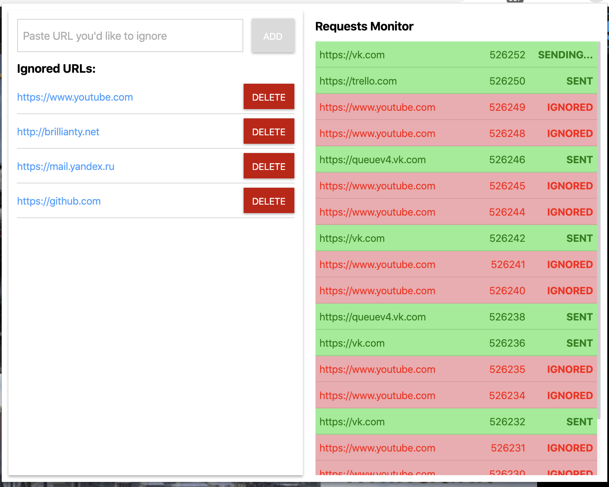

# Nexthink
Requests tracking extension  
Extension tracks all http requests and sends relevant requests data to server.

## Installation Steps:
1. Clone the repository
2. run `npm install`
3. run `npm run watch:dev`

Step number 3 will create DIST folder in app directory. This folder should
be loaded as extension in extensions manager 
_(chrome://extensions/ -> load unpacked -> select DIST folder)_

 
 

## Used technologies:
1. VueJs framework.
2. Axios for http requests
3. Server side - fake server side API (https://jsonplaceholder.typicode.com/) api that receives http requests and
returns responses. 
4. SASS syntax is used for styling.

 
 

## Design and features description:
Application is split to two sections:
1. Ignored URLs managing section. Here user can add or remove ignored URL. Http request from ignored urls will not be sent to server.
2. Requests monitor - this part is live updated and shows list of all http requests that had ever happened since extension was opened. The latest/newest request is always at the top of the list and so on. Ignored requests shown as red and have status IGNORED, requests that were sent to server are marked as green and have status SENT.  

###### Some features explanation:
1. Adding NEW url to ignore list takes only base url which means if dirty url with parameters has been copied from
browser bar and pasted in extension input field, pressing ADD will add only clean base url to ignored list. All added urls are stored in browser local storage and remove from there once url is deleted from ignored list.

2. Adding/Removing url to/from ignore list will affect immediately the requests management.

3. **Request statuses in monitor section:** each request row may have one of 3 statuses: IGNORED/SENDING/SENT. If request initiator url exists in ignored list it will get status IGNORED and will not be sent to server. If request initiator url is not in ignored list, the request data will be sent to server, in this case the request row will get status SENDING... once the request returns a response from the server status will automatically change to SENT. 

